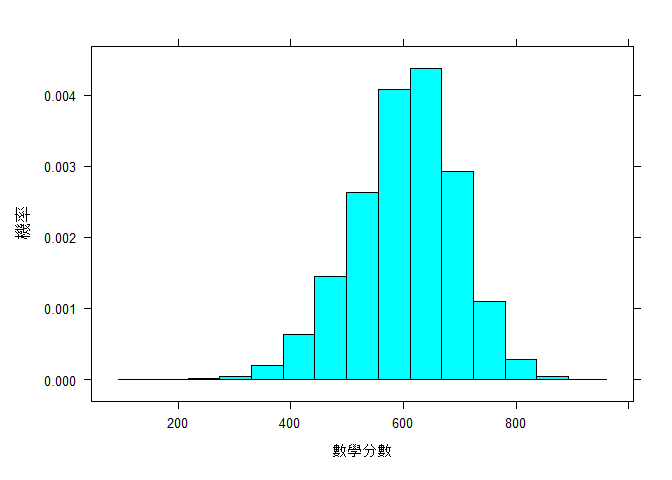
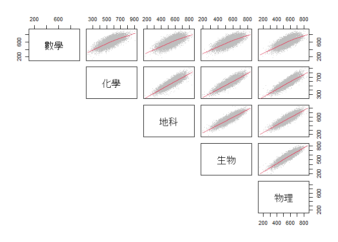
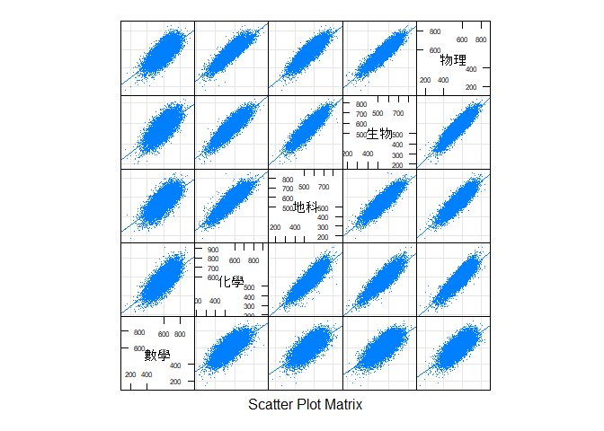
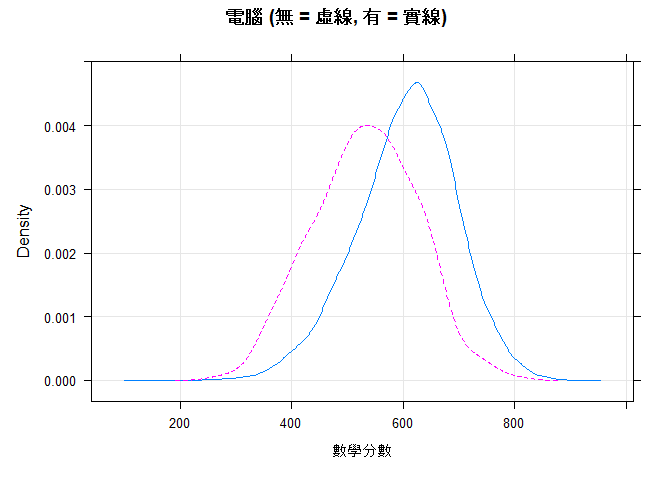
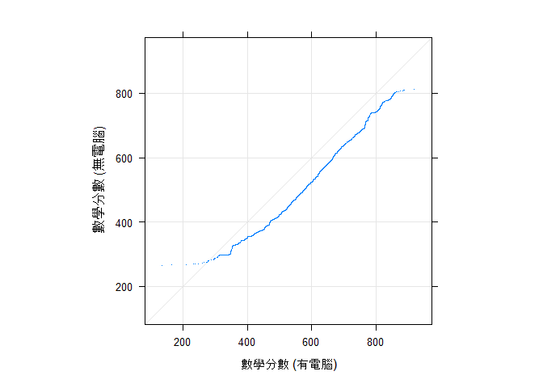
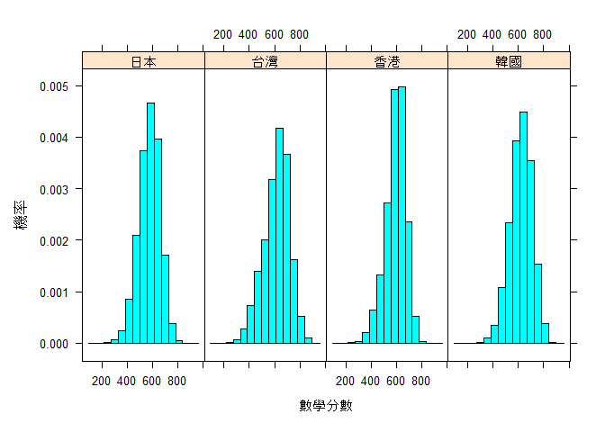
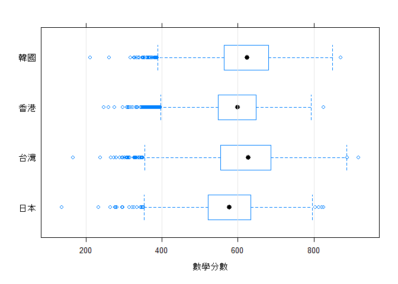
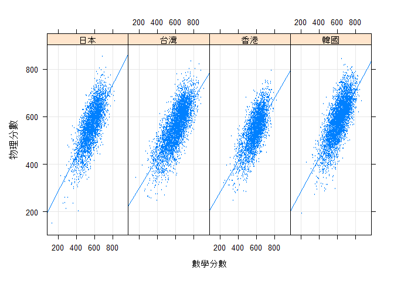
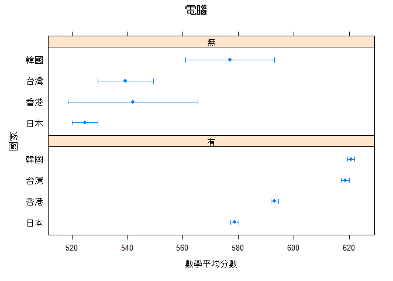

R在行為科學之應用:第二章
================
鄭中平、許清芳

``` r
# 推薦作業系統是設定為中文語系, 若為英文語系:
# 要改為中文語系，Windows 作業系統使用者在 R Console 輸入：
Sys.setlocale(category = "LC_ALL", locale = "cht")
# Mac 作業系統使用者輸入：
# Sys.setlocale(category = "LC_ALL", locale = "zh_TW.UTF-8")
```

``` r
#讀檔案，資料來自於 TIMSS 2011 年
fL <- "http://myweb.ncku.edu.tw/~cpcheng/Rbook/02/data/TIMSSmath.txt"
dta <- read.table(fL, header = TRUE, fileEncoding = 'big5')
```

``` r
#檢視資料結構
#程式報表2.2
str(dta)
```

    ## 'data.frame':    15549 obs. of  14 variables:
    ##  $ 國家    : chr  "台灣" "台灣" "台灣" "台灣" ...
    ##  $ 性別    : chr  "女生" "女生" "女生" "女生" ...
    ##  $ 父母教育: chr  "高中" "高中" "國小以下" "初中" ...
    ##  $ 數學    : num  729 776 718 607 658 ...
    ##  $ 化學    : num  625 662 709 633 618 ...
    ##  $ 地科    : num  608 666 629 620 614 ...
    ##  $ 生物    : num  651 628 617 592 560 ...
    ##  $ 物理    : num  618 617 663 616 591 ...
    ##  $ 電腦    : chr  "有" "有" "有" "有" ...
    ##  $ 書桌    : chr  "無" "有" "有" "無" ...
    ##  $ 書      : chr  "有" "有" "無" "無" ...
    ##  $ 房間    : chr  "無" "無" "無" "無" ...
    ##  $ 網路    : chr  "有" "有" "有" "有" ...
    ##  $ 書量    : chr  "26-100本" "11-25本" "10本以下" "200本以上" ...

``` r
#看看前六筆
#程式報表2.1
head(dta)
```

    ##   國家 性別 父母教育     數學     化學     地科     生物     物理 電腦 書桌 書
    ## 1 台灣 女生     高中 729.3937 624.7918 607.8187 650.6866 618.3397   有   無 有
    ## 2 台灣 女生     高中 776.1965 661.7790 665.7075 627.9452 616.7004   有   有 有
    ## 3 台灣 女生 國小以下 718.1735 708.7784 629.3393 617.4507 663.3176   有   有 無
    ## 4 台灣 女生     初中 607.1847 632.9836 620.3192 592.0527 616.4611   有   無 無
    ## 5 台灣 女生 大學以上 658.1759 617.8183 614.0907 560.1919 591.0047   有   無 無
    ## 6 台灣 女生     專科 478.5763 601.2205 591.0417 598.7882 553.9959   有   有 有
    ##   房間 網路      書量
    ## 1   無   有  26-100本
    ## 2   無   有   11-25本
    ## 3   無   有  10本以下
    ## 4   無   有 200本以上
    ## 5   無   有  26-100本
    ## 6   有   有  26-100本

``` r
#看看資料基本統計#
#程式報表2.3
summary(dta)
```

    ##      國家               性別             父母教育              數學      
    ##  Length:15549       Length:15549       Length:15549       Min.   :136.2  
    ##  Class :character   Class :character   Class :character   1st Qu.:546.0  
    ##  Mode  :character   Mode  :character   Mode  :character   Median :609.3  
    ##                                                           Mean   :603.2  
    ##                                                           3rd Qu.:666.3  
    ##                                                           Max.   :918.1  
    ##       化學            地科            生物            物理      
    ##  Min.   :227.5   Min.   :172.2   Min.   :196.0   Min.   :151.9  
    ##  1st Qu.:509.5   1st Qu.:507.5   1st Qu.:510.4   1st Qu.:510.8  
    ##  Median :565.6   Median :563.1   Median :565.6   Median :568.0  
    ##  Mean   :564.4   Mean   :558.8   Mean   :560.3   Mean   :563.9  
    ##  3rd Qu.:621.4   3rd Qu.:613.9   3rd Qu.:614.2   3rd Qu.:621.2  
    ##  Max.   :909.7   Max.   :848.2   Max.   :829.1   Max.   :852.5  
    ##      電腦               書桌                書                房間          
    ##  Length:15549       Length:15549       Length:15549       Length:15549      
    ##  Class :character   Class :character   Class :character   Class :character  
    ##  Mode  :character   Mode  :character   Mode  :character   Mode  :character  
    ##                                                                             
    ##                                                                             
    ##                                                                             
    ##      網路               書量          
    ##  Length:15549       Length:15549      
    ##  Class :character   Class :character  
    ##  Mode  :character   Mode  :character  
    ##                                       
    ##                                       
    ## 

``` r
#載進 lattice，準備畫圖。
library(lattice)
```

``` r
#看看數學分數的直方圖
#圖2.1
histogram(~ 數學, data = dta, xlab = '數學分數', ylab='機率',type = "density")
```



``` r
##連續變項間關係
#把學科分數取出來
dta_scores <- dta[, c('數學', '化學', '地科', '生物', '物理')]
```

``` r
#兩兩變項畫散佈圖
#圖2.2
pairs(dta_scores, pch = '.', upper.panel = panel.smooth, lower.panel = NULL, 
      col = 'gray')
```



``` r
#利用 lattice 的 splom 指令重畫兩兩變項散佈圖，算是進階版
#圖2.3
splom(~ dta_scores, cex = 0.1, pch = '.', axis.text.cex = 0.5, 
      type = c('p', 'r', 'g'))
```



``` r
#數學與物理分數相關
round(cor(dta$數學,dta$物理), 3)
```

    ## [1] 0.725

``` r
#所有學科分數相關
#程式報表2.4
round(cor(dta_scores), 3)
```

    ##       數學  化學  地科  生物  物理
    ## 數學 1.000 0.723 0.694 0.711 0.725
    ## 化學 0.723 1.000 0.857 0.868 0.859
    ## 地科 0.694 0.857 1.000 0.876 0.861
    ## 生物 0.711 0.868 0.876 1.000 0.897
    ## 物理 0.725 0.859 0.861 0.897 1.000

``` r
#檢定相關是否顯著，也可以看到信賴區間
cor.test( ~ 數學 + 物理, data = dta_scores)
```

    ## 
    ##  Pearson's product-moment correlation
    ## 
    ## data:  數學 and 物理
    ## t = 131.06, df = 15547, p-value < 2.2e-16
    ## alternative hypothesis: true correlation is not equal to 0
    ## 95 percent confidence interval:
    ##  0.7169507 0.7318879
    ## sample estimates:
    ##       cor 
    ## 0.7245044

``` r
#載進 Hmist，一次檢定所有相關
library(Hmisc)
```

``` r
#程式報表2.5
rcorr(as.matrix(dta_scores), type="pearson")
```

    ##      數學 化學 地科 生物 物理
    ## 數學 1.00 0.72 0.69 0.71 0.72
    ## 化學 0.72 1.00 0.86 0.87 0.86
    ## 地科 0.69 0.86 1.00 0.88 0.86
    ## 生物 0.71 0.87 0.88 1.00 0.90
    ## 物理 0.72 0.86 0.86 0.90 1.00
    ## 
    ## n= 15549 
    ## 
    ## 
    ## P
    ##      數學 化學 地科 生物 物理
    ## 數學       0    0    0    0  
    ## 化學  0         0    0    0  
    ## 地科  0    0         0    0  
    ## 生物  0    0    0         0  
    ## 物理  0    0    0    0

``` r
#載進 cocor
library(cocor)
```

``` r
#檢驗數學與物理、數學與生物何者相關高
#程式報表2.6
library(cocor)
cocor(~數學 + 物理 | 數學 + 生物, dta)
```

    ## 
    ##   Results of a comparison of two overlapping correlations based on dependent groups
    ## 
    ## Comparison between r.jk (數學, 物理) = 0.7245 and r.jh (數學, 生物) = 0.7108
    ## Difference: r.jk - r.jh = 0.0137
    ## Related correlation: r.kh = 0.8972
    ## Data: dta: j = 數學, k = 物理, h = 生物
    ## Group size: n = 15549
    ## Null hypothesis: r.jk is equal to r.jh
    ## Alternative hypothesis: r.jk is not equal to r.jh (two-sided)
    ## Alpha: 0.05
    ## 
    ## pearson1898: Pearson and Filon's z (1898)
    ##   z = 5.5418, p-value = 0.0000
    ##   Null hypothesis rejected
    ## 
    ## hotelling1940: Hotelling's t (1940)
    ##   t = 5.5631, df = 15546, p-value = 0.0000
    ##   Null hypothesis rejected
    ## 
    ## williams1959: Williams' t (1959)
    ##   t = 5.5544, df = 15546, p-value = 0.0000
    ##   Null hypothesis rejected
    ## 
    ## olkin1967: Olkin's z (1967)
    ##   z = 5.5418, p-value = 0.0000
    ##   Null hypothesis rejected
    ## 
    ## dunn1969: Dunn and Clark's z (1969)
    ##   z = 5.5518, p-value = 0.0000
    ##   Null hypothesis rejected
    ## 
    ## hendrickson1970: Hendrickson, Stanley, and Hills' (1970) modification of Williams' t (1959)
    ##   t = 5.5631, df = 15546, p-value = 0.0000
    ##   Null hypothesis rejected
    ## 
    ## steiger1980: Steiger's (1980) modification of Dunn and Clark's z (1969) using average correlations
    ##   z = 5.5498, p-value = 0.0000
    ##   Null hypothesis rejected
    ## 
    ## meng1992: Meng, Rosenthal, and Rubin's z (1992)
    ##   z = 5.5496, p-value = 0.0000
    ##   Null hypothesis rejected
    ##   95% confidence interval for r.jk - r.jh: 0.0182 0.0381
    ##   Null hypothesis rejected (Interval does not include 0)
    ## 
    ## hittner2003: Hittner, May, and Silver's (2003) modification of Dunn and Clark's z (1969) using a backtransformed average Fisher's (1921) Z procedure
    ##   z = 5.5493, p-value = 0.0000
    ##   Null hypothesis rejected
    ## 
    ## zou2007: Zou's (2007) confidence interval
    ##   95% confidence interval for r.jk - r.jh: 0.0088 0.0185
    ##   Null hypothesis rejected (Interval does not include 0)

``` r
cocor(~數學 + 物理 | 地科 + 生物, dta)
```

    ## 
    ##   Results of a comparison of two nonoverlapping correlations based on dependent groups
    ## 
    ## Comparison between r.jk (數學, 物理) = 0.7245 and r.hm (地科, 生物) = 0.8764
    ## Difference: r.jk - r.hm = -0.1519
    ## Related correlations: r.jh = 0.6937, r.jm = 0.7108, r.kh = 0.8612, r.km = 0.8972
    ## Data: dta: j = 數學, k = 物理, h = 地科, m = 生物
    ## Group size: n = 15549
    ## Null hypothesis: r.jk is equal to r.hm
    ## Alternative hypothesis: r.jk is not equal to r.hm (two-sided)
    ## Alpha: 0.05
    ## 
    ## pearson1898: Pearson and Filon's z (1898)
    ##   z = -42.2316, p-value = 0.0000
    ##   Null hypothesis rejected
    ## 
    ## dunn1969: Dunn and Clark's z (1969)
    ##   z = -48.6493, p-value = 0.0000
    ##   Null hypothesis rejected
    ## 
    ## steiger1980: Steiger's (1980) modification of Dunn and Clark's z (1969) using average correlations
    ##   z = -48.1480, p-value = 0.0000
    ##   Null hypothesis rejected
    ## 
    ## raghunathan1996: Raghunathan, Rosenthal, and Rubin's (1996) modification of Pearson and Filon's z (1898)
    ##   z = -48.6493, p-value = 0.0000
    ##   Null hypothesis rejected
    ## 
    ## silver2004: Silver, Hittner, and May's (2004) modification of Dunn and Clark's z (1969) using a backtransformed average Fisher's (1921) Z procedure
    ##   z = -47.8431, p-value = 0.0000
    ##   Null hypothesis rejected
    ## 
    ## zou2007: Zou's (2007) confidence interval
    ##   95% confidence interval for r.jk - r.hm: -0.1590 -0.1449
    ##   Null hypothesis rejected (Interval does not include 0)

``` r
##連續變項與類別變項間的關係
##兩個類別
#看看家裡有無電腦跟數學間的關係
#圖2.4
densityplot(~ 數學, groups = 電腦, data = dta, xlab = '數學分數', lty = c(1,2),
  plot.points = F, type = "g", , main = '電腦 (無 = 虛線, 有 = 實線)')
```



``` r
#也可用QQ圖比較
#圖2.5
qq(電腦 ~ 數學, data = dta, type = c('p', 'g'), pch = '.', aspect = 1, 
   xlab = '數學分數 (有電腦)', ylab = '數學分數 (無電腦)')
```



``` r
#看看有無電腦的學生數學平均與數標差
aggregate(數學 ~ 電腦, data = dta, FUN = mean)
```

    ##   電腦     數學
    ## 1   有 605.5098
    ## 2   無 532.7131

``` r
aggregate(數學 ~ 電腦, data = dta, FUN = sd)
```

    ##   電腦     數學
    ## 1   有 90.27149
    ## 2   無 93.07106

``` r
##多個類別
#看看不同國家學生的資料分數直方圖
#圖2.6
histogram(~ 數學 | 國家, data = dta, xlab = '數學分數', ylab='機率',
          type = 'density', layout = c(4, 1))
```



``` r
#以盒鬚圖看不同國家學生的差異
#圖2.7
bwplot(國家 ~ 數學, data = dta, xlab = '數學分數',
  panel = function(x, y, ...) {
    panel.bwplot(x, y, ...)
    panel.grid(v = -1, h = 0, ...) })
```



``` r
#看看不同國家的學生數學平均與數標差
aggregate(數學 ~ 國家, data = dta, FUN = mean)
```

    ##   國家     數學
    ## 1 日本 573.7170
    ## 2 台灣 616.4054
    ## 3 香港 592.8587
    ## 4 韓國 620.3121

``` r
aggregate(數學 ~ 國家, data = dta, FUN = sd)
```

    ##   國家      數學
    ## 1 日本  83.42566
    ## 2 台灣 101.97112
    ## 3 香港  79.96656
    ## 4 韓國  86.35808

``` r
#看看不同國家間，物理與數學間的關係是否類似
#圖2.8
xyplot(物理 ~ 數學 |  國家, data = dta, xlab = '數學分數', ylab = '物理分數',
       type = c("g", "p", "r"), cex = 0.1, layout = c(4, 1))
```



``` r
##連續變項與兩個類別變項間的關係
#看看不同國家、有無電腦的學生數學平均與對應的平均數標準誤
#程式報表2.7
show(m0 <- aggregate(數學 ~ 國家 + 電腦, data = dta, FUN = mean))
```

    ##   國家 電腦     數學
    ## 1 日本   有 578.7294
    ## 2 台灣   有 618.5894
    ## 3 香港   有 593.1577
    ## 4 韓國   有 620.6642
    ## 5 日本   無 524.6525
    ## 6 台灣   無 539.3525
    ## 7 香港   無 542.0274
    ## 8 韓國   無 576.9508

``` r
show(m1 <- aggregate(數學 ~ 國家 + 電腦, data = dta, function(x) sd(x)/sqrt(length(x))))
```

    ##   國家 電腦      數學
    ## 1 日本   有  1.469768
    ## 2 台灣   有  1.518699
    ## 3 香港   有  1.403073
    ## 4 韓國   有  1.313146
    ## 5 日本   無  4.645107
    ## 6 台灣   無  9.954817
    ## 7 香港   無 23.474131
    ## 8 韓國   無 16.026719

``` r
#把資料集中，並重排國家
m <- data.frame(m0, l = m0$數學 - m1$數學, u = m0$數學 + m1$數學)
m$國家 <- factor(m$國家, levels=c('日本', '香港', '台灣', '韓國'))
```

``` r
#載入 latticeExtra 套件
library(latticeExtra)
```

``` r
#在圖中加入了誤差
#圖2.9
segplot( 國家 ~ l + u | 電腦, data = m, centers = 數學, 
        draw.bands = F, xlab = '數學平均分數', ylab = '國家',
        main = '電腦', layout = c(1, 2),
        segments.fun = panel.arrows, ends = "both", angle = 90, length = 1, 
        unit = "mm")
```


