R在行為科學之應用:第三章: 迴歸分析
================
鄭中平、許清芳

``` r
# 推薦作業系統是設定為中文語系, 若為英文語系:
# 要改為中文語系，Windows 作業系統使用者在 R Console 輸入：
Sys.setlocale(category = "LC_ALL", locale = "cht")
# Mac 作業系統使用者輸入：
# Sys.setlocale(category = "LC_ALL", locale = "zh_TW.UTF-8")
```

``` r
#資料來自於 TIMSS 2011 年台灣資料
#讀檔案
fLoc <- "http://myweb.ncku.edu.tw/~csheu/Rbook/03/data/TIMSS2011TW.txt"
dta <- read.table(fLoc, header = TRUE)
```

``` r
#看資料結構與前六筆
#程式報表3.1
str(dta)
```

    ## 'data.frame':    4467 obs. of  13 variables:
    ##  $ 性別    : chr  "女生" "女生" "女生" "女生" ...
    ##  $ 數學    : num  729 776 718 607 658 ...
    ##  $ 數學興趣: num  8.93 13.47 9.6 13.47 8.27 ...
    ##  $ 數學評價: num  9.34 9.34 10.35 10.35 8.21 ...
    ##  $ 數學投入: num  9.16 12.42 10.15 8.71 7.86 ...
    ##  $ 數學時數: chr  "四十五分到三小時間" "四十五分以下" "四十五分以下" "四十五分以下" ...
    ##  $ 科學    : num  683 663 667 575 650 ...
    ##  $ 科學興趣: num  7.65 7.65 9.42 9.42 9.04 ...
    ##  $ 科學評價: num  9.16 6.53 11.09 7.6 8.23 ...
    ##  $ 科學投入: num  8.3 7.92 9.55 7.92 8.7 ...
    ##  $ 科學時數: chr  "四十五分以下" "四十五分以下" "四十五分以下" "四十五分以下" ...
    ##  $ 父母教育: chr  "高中" "高中" "國小以下" "初中" ...
    ##  $ 教育資源: num  9.6 8.92 6.33 10.25 10.93 ...

``` r
head(dta)
```

    ##   性別     數學 數學興趣 數學評價 數學投入           數學時數     科學 科學興趣
    ## 1 女生 729.3937  8.93041  9.34439  9.15641 四十五分到三小時間 682.7541  7.64598
    ## 2 女生 776.1965 13.46507  9.34439 12.42205       四十五分以下 663.3682  7.64598
    ## 3 女生 718.1735  9.60333 10.35139 10.15325       四十五分以下 667.1151  9.41832
    ## 4 女生 607.1847 13.46507 10.35139  8.70884       四十五分以下 575.0923  9.41832
    ## 5 女生 658.1759  8.26761  8.20673  7.85736 四十五分到三小時間 649.7578  9.03893
    ## 6 女生 478.5763  6.36452  7.27410  7.85736       四十五分以下 491.3467 12.94370
    ##   科學評價 科學投入     科學時數 父母教育 教育資源
    ## 1  9.15956  8.30491 四十五分以下     高中  9.60097
    ## 2  6.52660  7.91938 四十五分以下     高中  8.91919
    ## 3 11.09147  9.54897 四十五分以下 國小以下  6.33067
    ## 4  7.60129  7.91938 四十五分以下     初中 10.25396
    ## 5  8.23142  8.69954 四十五分以下 大學以上 10.92551
    ## 6  9.15956 10.57281 四十五分以下     專科 10.92551

``` r
#看資料基本統計
#程式報表3.2
summary(dta)
```

    ##      性別                數學          數學興趣         數學評價     
    ##  Length:4467        Min.   :166.4   Min.   : 5.037   Min.   : 3.412  
    ##  Class :character   1st Qu.:556.0   1st Qu.: 7.912   1st Qu.: 7.274  
    ##  Mode  :character   Median :629.9   Median : 8.930   Median : 8.207  
    ##                     Mean   :618.1   Mean   : 9.079   Mean   : 8.357  
    ##                     3rd Qu.:687.6   3rd Qu.: 9.965   3rd Qu.: 9.344  
    ##                     Max.   :918.1   Max.   :13.465   Max.   :13.707  
    ##     數學投入        數學時數              科學          科學興趣     
    ##  Min.   : 3.265   Length:4467        Min.   :178.8   Min.   : 4.513  
    ##  1st Qu.: 7.857   Class :character   1st Qu.:517.9   1st Qu.: 7.989  
    ##  Median : 8.584   Mode  :character   Median :577.5   Median : 9.039  
    ##  Mean   : 8.583                      Mean   :570.6   Mean   : 9.010  
    ##  3rd Qu.: 9.635                      3rd Qu.:627.2   3rd Qu.: 9.827  
    ##  Max.   :14.343                      Max.   :844.3   Max.   :12.944  
    ##     科學評價         科學投入        科學時數           父母教育        
    ##  Min.   : 4.136   Min.   : 3.556   Length:4467        Length:4467       
    ##  1st Qu.: 7.601   1st Qu.: 7.524   Class :character   Class :character  
    ##  Median : 8.540   Median : 8.700   Mode  :character   Mode  :character  
    ##  Mean   : 8.556   Mean   : 8.613                                        
    ##  3rd Qu.: 9.479   3rd Qu.: 9.549                                        
    ##  Max.   :13.103   Max.   :13.833                                        
    ##     教育資源     
    ##  Min.   : 4.323  
    ##  1st Qu.: 9.601  
    ##  Median :10.254  
    ##  Mean   :10.486  
    ##  3rd Qu.:11.649  
    ##  Max.   :14.018

``` r
#載進 ggplot2 準備畫圖
library(ggplot2)
```

``` r
#底下的圖都用黑白配色（theme_bw），先記下目前的設定
#最後要記得改回來
old <- theme_set(theme_bw())
```

``` r
#看不同性別數學分數的盒鬚圖
#圖3.1
ggplot(data = dta, aes(x = 性別, y = 數學)) +
 geom_boxplot() + 
 coord_flip() +
 labs( y = '分數', x = '性別', title = '數學分數盒鬚圖')
```

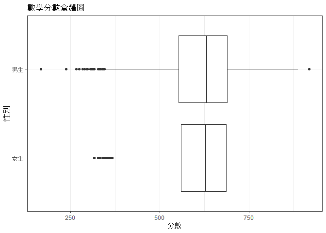<!-- -->

``` r
#看信賴區間
with(dta, tapply(數學, 性別,
     function(x) c(mean(x) + c(-2, 2) * sd(x)/sqrt(length(x)))))
```

    ## $女生
    ## [1] 615.4899 623.5705
    ## 
    ## $男生
    ## [1] 612.0913 621.0584

``` r
#以t檢定比較不同性別的數學差異、預設作法會做 Welch 校正
#程式報表3.3
t.test(數學 ~ 性別, data = dta)
```

    ## 
    ##  Welch Two Sample t-test
    ## 
    ## data:  數學 by 性別
    ## t = 0.97932, df = 4414, p-value = 0.3275
    ## alternative hypothesis: true difference in means between group 女生 and group 男生 is not equal to 0
    ## 95 percent confidence interval:
    ##  -2.960942  8.871550
    ## sample estimates:
    ## mean in group 女生 mean in group 男生 
    ##           619.5302           616.5749

``` r
#這才是一般假設變異數同值下的 t 檢定
#程式報表3.4
t.test(數學 ~ 性別, data = dta, var.equal = TRUE)
```

    ## 
    ##  Two Sample t-test
    ## 
    ## data:  數學 by 性別
    ## t = 0.97969, df = 4465, p-value = 0.3273
    ## alternative hypothesis: true difference in means between group 女生 and group 男生 is not equal to 0
    ## 95 percent confidence interval:
    ##  -2.958673  8.869280
    ## sample estimates:
    ## mean in group 女生 mean in group 男生 
    ##           619.5302           616.5749

``` r
#看不同父母教育背景者的數學成績差異
#先把父母教育各個水準順序定下來
dta$父母教育 <- factor(dta$父母教育, levels = c('國小以下', '初中', '高中',
                                                '專科', '大學以上'))
```

``` r
#看不同父母教育程度下的數學分數平均數
with(dta, tapply(數學, 父母教育, mean) )
```

    ## 國小以下     初中     高中     專科 大學以上 
    ## 536.5940 558.7106 598.8742 645.2816 660.9434

``` r
#圖示不同父母教育程度下的數學分數平均數，加上信賴區間
#圖3.2
ggplot(data = dta, aes(x = 父母教育, y = 數學)) +
  stat_summary(fun.data = 'mean_cl_boot', size = 1) +
  scale_y_continuous(breaks = seq(500, 660, by = 20)) +
  geom_hline(yintercept = mean(dta$數學) , linetype = 'dotted') +
  labs(x = '父母教育', y = '數學平均分數') +
  coord_flip()
```

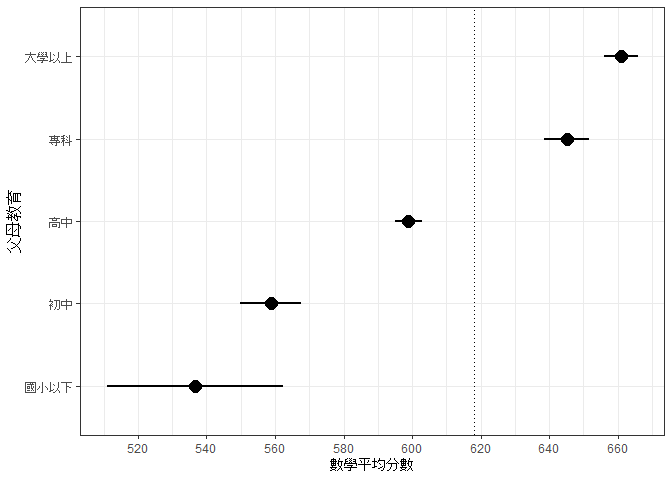<!-- -->

``` r
#檢定 
#程式報表3.5
anova(m1 <- lm(數學 ~ 父母教育, data = dta))
```

    ## Analysis of Variance Table
    ## 
    ## Response: 數學
    ##             Df   Sum Sq Mean Sq F value    Pr(>F)
    ## 父母教育     4  5634301 1408575  158.12 < 2.2e-16
    ## Residuals 4462 39748578    8908

``` r
summary(m1)$r.squared
```

    ## [1] 0.1241504

``` r
#父母教育的效果或許會是教育資源造成的，畫圖看看
#圖3.3
ggplot(data = dta, aes(y = 數學, x = 教育資源)) +
  stat_smooth(method = 'lm', se = F, formula = y ~ x) +
  facet_grid( . ~  父母教育) +
  labs(x = '教育資源', y = '數學分數')
```

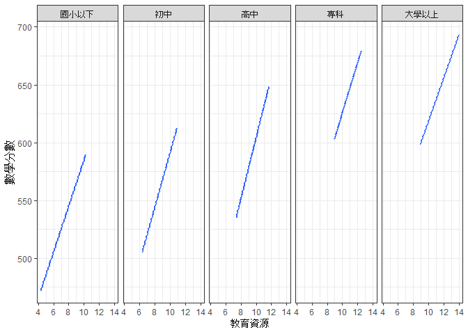<!-- -->

``` r
#把教育資源加進模型
#程式報表3.6
anova(m2 <- update(m1, . ~ . + 教育資源, data = dta))
```

    ## Analysis of Variance Table
    ## 
    ## Response: 數學
    ##             Df   Sum Sq Mean Sq F value    Pr(>F)
    ## 父母教育     4  5634301 1408575  168.57 < 2.2e-16
    ## 教育資源     1  2471927 2471927  295.82 < 2.2e-16
    ## Residuals 4461 37276651    8356

``` r
#或許不是父母教育而是教育資源造成，這邊只考慮教育資源
#程式報表3.7
anova(m3 <- update(m2, . ~ . - 父母教育,  data = dta))
```

    ## Analysis of Variance Table
    ## 
    ## Response: 數學
    ##             Df   Sum Sq Mean Sq F value    Pr(>F)
    ## 教育資源     1  7799321 7799321  926.57 < 2.2e-16
    ## Residuals 4465 37583557    8417

``` r
#將結果放在一個list中，等一下比較方便抓結果
res_lm <- lapply(list(m1, m2, m3), summary)
```

``` r
#比較在控制教育資源下，父母教育的效果
#程式報表3.8
(res_lm[[2]]$r.sq - res_lm[[3]]$r.sq)/res_lm[[2]]$r.sq
```

    ## [1] 0.03786054

``` r
anova(m3, m2)
```

    ## Analysis of Variance Table
    ## 
    ## Model 1: 數學 ~ 教育資源
    ## Model 2: 數學 ~ 父母教育 + 教育資源
    ##   Res.Df      RSS Df Sum of Sq      F    Pr(>F)
    ## 1   4465 37583557                              
    ## 2   4461 37276651  4    306906 9.1821 2.192e-07

``` r
#比較在控制父母教育下，教育資源的效果
(res_lm[[2]]$r.sq - res_lm[[1]]$r.sq)/res_lm[[1]]$r.sq
```

    ## [1] 0.4387283

``` r
anova(m1, m2)
```

    ## Analysis of Variance Table
    ## 
    ## Model 1: 數學 ~ 父母教育
    ## Model 2: 數學 ~ 父母教育 + 教育資源
    ##   Res.Df      RSS Df Sum of Sq      F    Pr(>F)
    ## 1   4462 39748578                              
    ## 2   4461 37276651  1   2471927 295.82 < 2.2e-16

``` r
#畫效果
library(coefplot)
coefplot(m2, xlab = '估計值', ylab = '迴歸變項', title = '反應變項 = 數學分數')
```

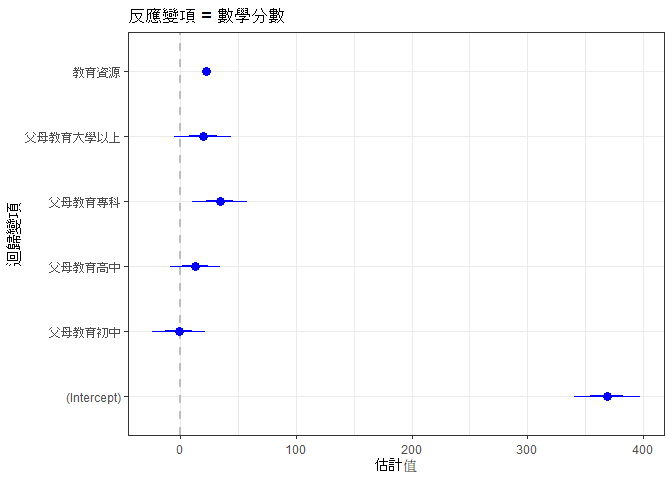<!-- -->

``` r
#將截距去除，畫更易懂起來
#圖3.4
m2 <- lm(數學 ~ 父母教育+教育資源- 1, data = dta)
coefplot(m2, xlab = '估計值', ylab = '迴歸變項', title = '反應變項 = 數學分數')
```

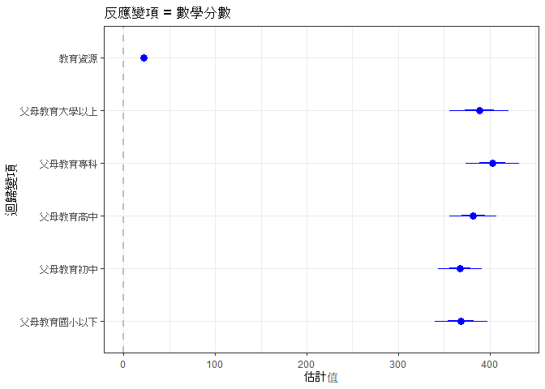<!-- -->

``` r
#把資料與迴歸分析的預測值、殘差與影響度放進資料
fit_m2 <- data.frame(dta[, c(2, 12, 13)], fitted = fitted(m2), resid = resid(m2),
                     infl = influence(m2)$hat )
```

``` r
#疊合真實觀測值預測值的直方圖，依父母教育
#圖3.5
ggplot(data = fit_m2, aes(x = 數學)) +
 stat_density(geom = 'path', position = 'identity') +
 stat_density(geom = 'path', position = 'identity', aes(x = fitted)) +
 geom_vline(xintercept = c(with(dta, tapply(數學,父母教育, mean))), linetype = 'dotted')+
 facet_grid(父母教育 ~ .) +
 scale_x_continuous(breaks = seq(200, 900, by = 100))+
 labs(x = '數學分數', y = '機率密度')
```

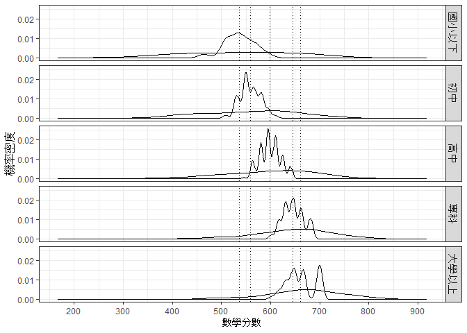<!-- -->

``` r
#看殘差分配，依父母教育，檢視常態與變異數同質假設
#圖3.6
ggplot(data = fit_m2, aes(x = scale(resid)), group = 父母教育 ) +
 stat_density(geom = 'path', position = 'identity', aes(linetype = 父母教育)) +
 scale_linetype_manual(values = 5:1) +
 guides(linetype = guide_legend(reverse = TRUE)) +
 labs(x = '標準化殘差', y = '機率密度') +
 theme(legend.position = c(.15, .8))
```

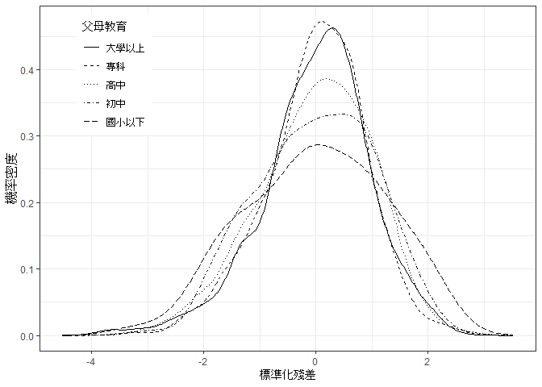<!-- -->

``` r
#看看殘差的 Q-Q 圖，依父母教育。檢視常態假設
#圖3.7
ggplot(fit_m2, aes(sample=scale(resid))) +
  facet_wrap(. ~ 父母教育)+
  stat_qq()+
  stat_qq_line()+
  labs(x = '常態位數', y = '標準化殘差')
```

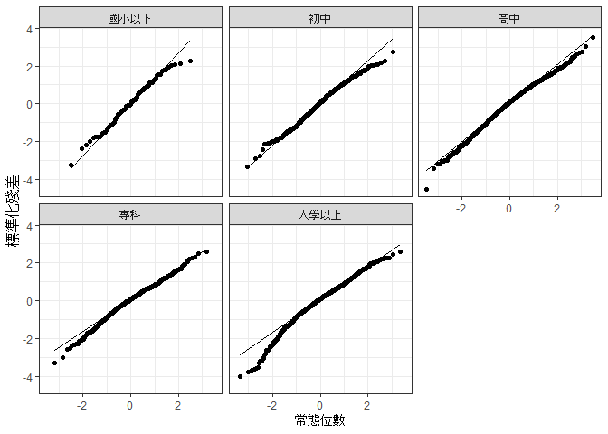<!-- -->

``` r
#畫預測值與殘差的散佈圖，檢查線性與等分散假設
#圖3.8
library(MASS)
ggplot(data = fit_m2, aes(x = fitted, y = scale(resid))) +
  geom_point(pch = 20, size = 1) +
  stat_smooth(method = 'rlm', se = F, formula = y ~ x) +
  facet_grid(父母教育 ~ .) +
  labs(x = '數學預測值', y = '標準化殘差')
```

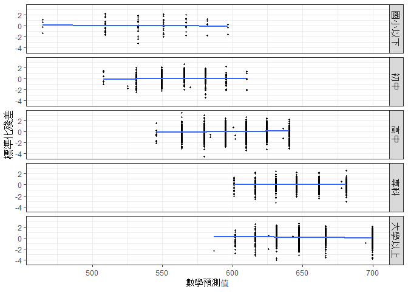<!-- -->

``` r
#呈現影響值（影響估計結果過大的值）與標準化殘差
#圖3.9
ggplot(data = fit_m2, aes(x = infl, y = scale(resid))) +
 geom_text(aes(label = rownames(fit_m2)), cex = 2) +
 geom_hline(yintercept = 0, linetype = 'dotted') +
 facet_grid(父母教育 ~ .) +
 labs(x = '影響值', y = '標準化殘差')
```

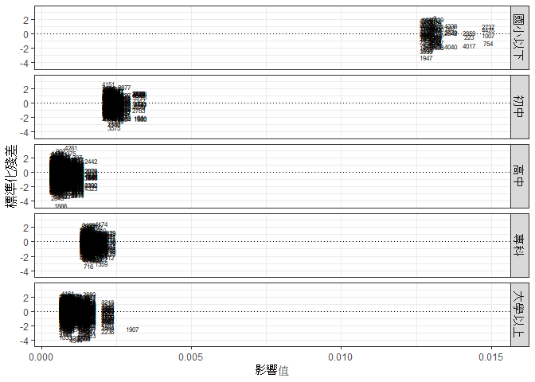<!-- -->

``` r
#看看影響值
summary(influence(m2)$hat)
```

    ##      Min.   1st Qu.    Median      Mean   3rd Qu.      Max. 
    ## 0.0004960 0.0006413 0.0008784 0.0013432 0.0015737 0.0149093

``` r
#底下要呈現多個連續解釋變項時的情形
#看看個人變項的可能效果，把跟數學有關的部分取出來
dta_math <- dta[, c('數學', '數學興趣', '數學評價', '數學投入')]
```

``` r
#看看基本統計量
colMeans(dta_math)
```

    ##       數學   數學興趣   數學評價   數學投入 
    ## 618.058149   9.079051   8.356993   8.583309

``` r
#呈現兩兩散佈圖
#圖3.10
library(heplots)
scatterplotMatrix(~ 數學 + 數學興趣 + 數學評價 + 數學投入, 
                  data= dta_math, pch = '.', cex = 3, 
                  smooth = FALSE, ellipse = TRUE, lower.panel = NULL)
```

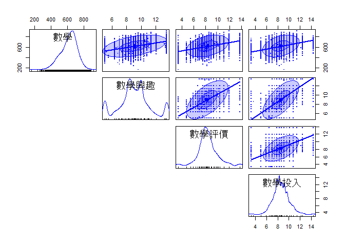<!-- -->

``` r
#卸下heplots套件, 命名coefplot衝突
detach("package:heplots", unload=TRUE)
```

``` r
#載入corrplot 套件，以圖形顯示相關大小
#圖3.11
library(corrplot)
corrplot(cor(dta_math), method = 'ellipse', order = 'hclust', addrect = 4,
         type = 'upper', tl.pos = 'tp')
corrplot(cor(dta_math), add = TRUE, type = 'lower', method = 'number',
         order = 'hclust', col = 'black', diag = FALSE, tl.pos = 'n', cl.pos = 'n')
```

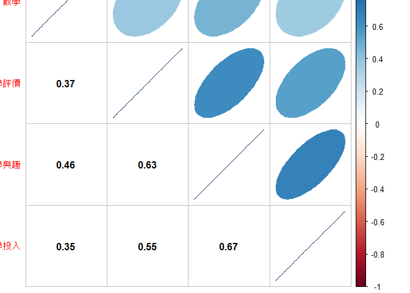<!-- -->

``` r
#放進三個解釋變項
#程式報表3.9
summary(m4 <- lm(數學 ~ 數學興趣 + 數學評價 + 數學投入, data = dta_math))
```

    ## 
    ## Call:
    ## lm(formula = 數學 ~ 數學興趣 + 數學評價 + 數學投入, data = dta_math)
    ## 
    ## Residuals:
    ##     Min      1Q  Median      3Q     Max 
    ## -427.11  -54.39    6.97   61.36  277.72 
    ## 
    ## Coefficients:
    ##             Estimate Std. Error t value Pr(>|t|)
    ## (Intercept) 383.4531     7.4041  51.790  < 2e-16
    ## 數學興趣     16.7783     0.9436  17.780  < 2e-16
    ## 數學評價      7.0554     0.9501   7.426 1.33e-13
    ## 數學投入      2.7160     1.0774   2.521   0.0117
    ## 
    ## Residual standard error: 88.76 on 4463 degrees of freedom
    ## Multiple R-squared:  0.2252, Adjusted R-squared:  0.2247 
    ## F-statistic: 432.5 on 3 and 4463 DF,  p-value: < 2.2e-16

``` r
#看效果
#圖3.12
coefplot::coefplot(m4, predictors = c('數學興趣', '數學評價', '數學投入'),
 xlab = '估計值', ylab = '迴歸變項(去除截距)', title = '反應變項是數學分數')
```

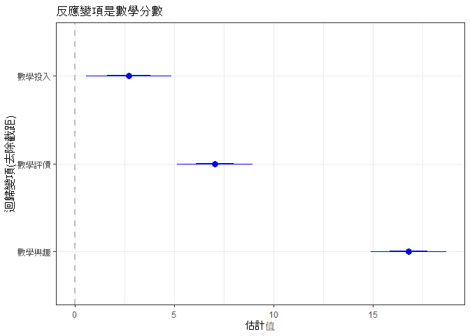<!-- -->

``` r
#看效果
#圖3.13
library(effects)
plot(allEffects(m4), main = '', ylim = c(550, 670), grid = T)
```

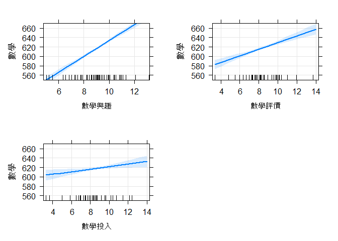<!-- -->

``` r
#載入 lm.beta套件，計算標準化迴歸係數
#程式報表3.10
library(lm.beta)
summary(lm.beta(m4))
```

    ## 
    ## Call:
    ## lm(formula = 數學 ~ 數學興趣 + 數學評價 + 數學投入, data = dta_math)
    ## 
    ## Residuals:
    ##     Min      1Q  Median      3Q     Max 
    ## -427.11  -54.39    6.97   61.36  277.72 
    ## 
    ## Coefficients:
    ##              Estimate Standardized Std. Error t value Pr(>|t|)
    ## (Intercept) 383.45307      0.00000    7.40407  51.790  < 2e-16
    ## 數學興趣     16.77826      0.34905    0.94365  17.780  < 2e-16
    ## 數學評價      7.05539      0.12893    0.95007   7.426 1.33e-13
    ## 數學投入      2.71604      0.04592    1.07742   2.521   0.0117
    ## 
    ## Residual standard error: 88.76 on 4463 degrees of freedom
    ## Multiple R-squared:  0.2252, Adjusted R-squared:  0.2247 
    ## F-statistic: 432.5 on 3 and 4463 DF,  p-value: < 2.2e-16

``` r
#看看控制數學興趣與數學評價後，數學投入的效果
summary(m5 <- update(m4, . ~ . - 數學投入 , data = dta_math))
```

    ## 
    ## Call:
    ## lm(formula = 數學 ~ 數學興趣 + 數學評價, data = dta_math)
    ## 
    ## Residuals:
    ##     Min      1Q  Median      3Q     Max 
    ## -423.64  -54.22    6.82   61.30  281.97 
    ## 
    ## Coefficients:
    ##             Estimate Std. Error t value Pr(>|t|)
    ## (Intercept) 391.5857     6.6683  58.724  < 2e-16
    ## 數學興趣     17.9769     0.8156  22.042  < 2e-16
    ## 數學評價      7.5696     0.9285   8.153 4.58e-16
    ## 
    ## Residual standard error: 88.81 on 4464 degrees of freedom
    ## Multiple R-squared:  0.2241, Adjusted R-squared:  0.2238 
    ## F-statistic: 644.8 on 2 and 4464 DF,  p-value: < 2.2e-16

``` r
anova(m5, m4)
```

    ## Analysis of Variance Table
    ## 
    ## Model 1: 數學 ~ 數學興趣 + 數學評價
    ## Model 2: 數學 ~ 數學興趣 + 數學評價 + 數學投入
    ##   Res.Df      RSS Df Sum of Sq      F  Pr(>F)
    ## 1   4464 35211080                            
    ## 2   4463 35161015  1     50065 6.3548 0.01174

``` r
#改回舊的配色，不然 R 就黑白下去了
theme_set(old)
```
