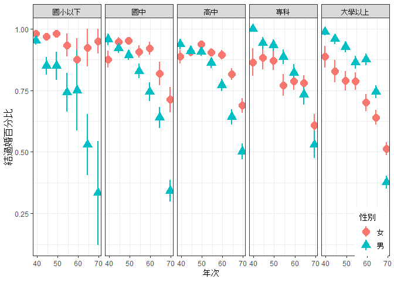
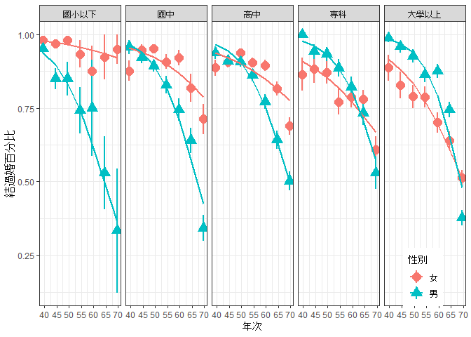
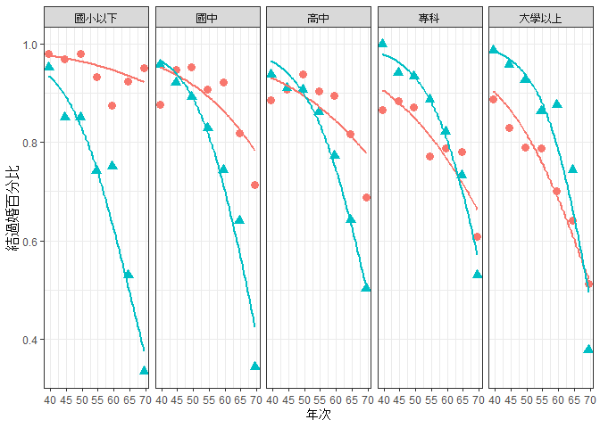
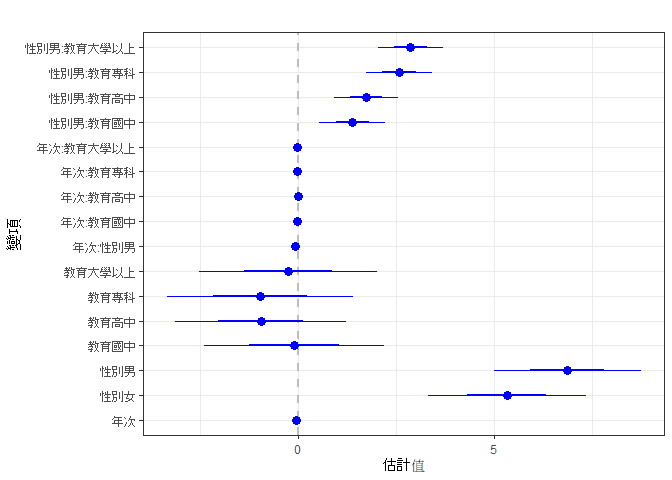
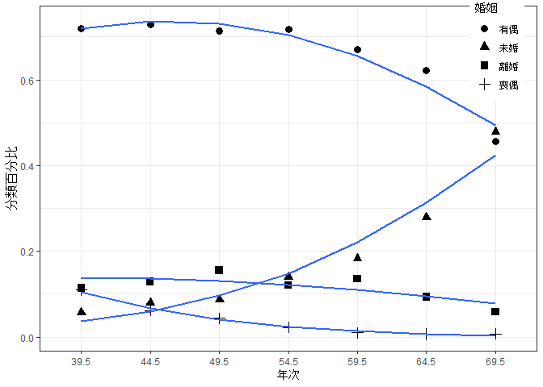

R在行為科學之應用: 第十一章 邏輯式迴歸
================
鄭中平、許清芳

``` r
# 推薦作業系統是設定為中文語系, 若為英文語系:
# 要改為中文語系，Windows 作業系統使用者在 R Console 輸入：
Sys.setlocale(category = "LC_ALL", locale = "cht")
# Mac 作業系統使用者輸入：
# Sys.setlocale(category = "LC_ALL", locale = "zh_TW.UTF-8")
```

``` r
#讀資料
fLoc <-"http://myweb.ncku.edu.tw/~cpcheng/Rbook/11/datanew/married.txt"
dta <- read.table(fLoc, header = T, fileEncoding = 'big5')
```

``` r
#顯示前六筆，看資料結構
#程式報表11.1
head(dta)
```

    ##       教育 性別 婚姻 年齡
    ## 1 大學以上   女 未婚 32.5
    ## 2     國中   男 有偶 57.5
    ## 3     專科   男 有偶 42.5
    ## 4 大學以上   男 有偶 42.5
    ## 5     高中   女 喪偶 62.5
    ## 6     高中   女 有偶 52.5

``` r
#程式報表11.2
str(dta)
```

    ## 'data.frame':    10000 obs. of  4 variables:
    ##  $ 教育: chr  "大學以上" "國中" "專科" "大學以上" ...
    ##  $ 性別: chr  "女" "男" "男" "男" ...
    ##  $ 婚姻: chr  "未婚" "有偶" "有偶" "有偶" ...
    ##  $ 年齡: num  32.5 57.5 42.5 42.5 62.5 52.5 32.5 37.5 42.5 62.5 ...

``` r
summary(dta)
```

    ##      教育               性別               婚姻                年齡      
    ##  Length:10000       Length:10000       Length:10000       Min.   :32.50  
    ##  Class :character   Class :character   Class :character   1st Qu.:37.50  
    ##  Mode  :character   Mode  :character   Mode  :character   Median :47.50  
    ##                                                           Mean   :46.62  
    ##                                                           3rd Qu.:52.50  
    ##                                                           Max.   :62.50

``` r
#重排教育各水準
dta$教育 <- factor(dta$教育, levels = c('國小以下', '國中', '高中',
'專科', '大學以上'))
```

``` r
#重排婚姻，由多到少
dta$婚姻 <- factor(dta$婚姻, levels = c('有偶', '未婚', '離婚', '喪偶'))
```

``` r
#將年齡換成年次
dta$年次 <- (102-dta$年齡)
```

``` r
#將婚姻狀況分為未婚與結過婚
dta$結過婚 <- ifelse(dta$婚姻 == '未婚', 0, 1)
```

``` r
#計算每個變項組別各百分比 
#程式報表11.3
apply(dta, 2, function(x) table(x)/dim(dta)[1])
```

    ## $教育
    ## x
    ## 大學以上     高中 國小以下     國中     專科 
    ##   0.2406   0.3297   0.1070   0.1867   0.1360 
    ## 
    ## $性別
    ## x
    ##     女     男 
    ## 0.5073 0.4927 
    ## 
    ## $婚姻
    ## x
    ##   未婚   有偶   喪偶   離婚 
    ## 0.1966 0.6550 0.0341 0.1143 
    ## 
    ## $年齡
    ## x
    ##   32.5   37.5   42.5   47.5   52.5   57.5   62.5 
    ## 0.1619 0.1516 0.1435 0.1434 0.1558 0.1306 0.1132 
    ## 
    ## $年次
    ## x
    ##   39.5   44.5   49.5   54.5   59.5   64.5   69.5 
    ## 0.1132 0.1306 0.1558 0.1434 0.1435 0.1516 0.1619 
    ## 
    ## $結過婚
    ## x
    ##      0      1 
    ## 0.1966 0.8034

``` r
#單一變項與結過婚與否的列聯表
#程式報表11.4
ftable(dta, row.vars = '教育', col.vars = '結過婚')
```

    ##          結過婚    0    1
    ## 教育                     
    ## 國小以下          72  998
    ## 國中             311 1556
    ## 高中             584 2713
    ## 專科             273 1087
    ## 大學以上         726 1680

``` r
ftable(dta, row.vars = '性別', col.vars = '結過婚')
```

    ##      結過婚    0    1
    ## 性別                 
    ## 女           894 4179
    ## 男          1072 3855

``` r
ftable(dta, row.vars = '年次', col.vars = '結過婚')
```

    ##      結過婚    0    1
    ## 年次                 
    ## 39.5          64 1068
    ## 44.5         105 1201
    ## 49.5         136 1422
    ## 54.5         201 1233
    ## 59.5         263 1172
    ## 64.5         422 1094
    ## 69.5         775  844

``` r
#兩個變項與結過婚與否的列聯表
#程式報表11.5
ftable(dta, row.vars = c('教育', '性別'), col.vars = '結過婚')
```

    ##               結過婚    0    1
    ## 教育     性別                 
    ## 國小以下 女            20  663
    ##          男            52  335
    ## 國中     女            85  746
    ##          男           226  810
    ## 高中     女           235 1472
    ##          男           349 1241
    ## 專科     女           155  524
    ##          男           118  563
    ## 大學以上 女           399  774
    ##          男           327  906

``` r
ftable(dta, row.vars = c('教育', '年次'), col.vars = '結過婚')
```

    ##               結過婚   0   1
    ## 教育     年次               
    ## 國小以下 39.5         15 478
    ##          44.5         21 276
    ##          49.5          8 131
    ##          54.5         10  51
    ##          59.5          4  20
    ##          64.5          9  21
    ##          69.5          5  21
    ## 國中     39.5         14 146
    ##          44.5         21 288
    ##          49.5         37 425
    ##          54.5         41 263
    ##          59.5         43 204
    ##          64.5         57 134
    ##          69.5         98  96
    ## 高中     39.5         23 236
    ##          44.5         37 368
    ##          49.5         42 500
    ##          54.5         65 497
    ##          59.5         90 458
    ##          64.5        132 366
    ##          69.5        195 288
    ## 專科     39.5          5  85
    ##          44.5         10 119
    ##          49.5         17 166
    ##          54.5         34 172
    ##          59.5         50 204
    ##          64.5         70 223
    ##          69.5         87 118
    ## 大學以上 39.5          7 123
    ##          44.5         16 150
    ##          49.5         32 200
    ##          54.5         51 250
    ##          59.5         76 286
    ##          64.5        154 350
    ##          69.5        390 321

``` r
ftable(dta, row.vars = c('性別', '年次'), col.vars = '結過婚')
```

    ##           結過婚   0   1
    ## 性別 年次               
    ## 女   39.5         43 576
    ##      44.5         49 597
    ##      49.5         62 708
    ##      54.5         93 603
    ##      59.5        123 605
    ##      64.5        187 573
    ##      69.5        337 517
    ## 男   39.5         21 492
    ##      44.5         56 604
    ##      49.5         74 714
    ##      54.5        108 630
    ##      59.5        140 567
    ##      64.5        235 521
    ##      69.5        438 327

``` r
#三個變項與結過婚與否的列聯表，也可以換成比率
ftable(dta, row.vars = c(1, 2, 5), col.vars = '結過婚')
```

    ##                    結過婚   0   1
    ## 教育     性別 年次               
    ## 國小以下 女   39.5          6 302
    ##               44.5          6 191
    ##               49.5          2  97
    ##               54.5          2  28
    ##               59.5          2  14
    ##               64.5          1  12
    ##               69.5          1  19
    ##          男   39.5          9 176
    ##               44.5         15  85
    ##               49.5          6  34
    ##               54.5          8  23
    ##               59.5          2   6
    ##               64.5          8   9
    ##               69.5          4   2
    ## 國中     女   39.5         11  78
    ##               44.5          7 124
    ##               49.5         10 200
    ##               54.5         13 128
    ##               59.5          9 105
    ##               64.5         12  54
    ##               69.5         23  57
    ##          男   39.5          3  68
    ##               44.5         14 164
    ##               49.5         27 225
    ##               54.5         28 135
    ##               59.5         34  99
    ##               64.5         45  80
    ##               69.5         75  39
    ## 高中     女   39.5         15 117
    ##               44.5         19 186
    ##               49.5         17 257
    ##               54.5         29 272
    ##               59.5         30 255
    ##               64.5         49 217
    ##               69.5         76 168
    ##          男   39.5          8 119
    ##               44.5         18 182
    ##               49.5         25 243
    ##               54.5         36 225
    ##               59.5         60 203
    ##               64.5         83 149
    ##               69.5        119 120
    ## 專科     女   39.5          5  32
    ##               44.5          5  38
    ##               49.5         10  68
    ##               54.5         21  71
    ##               59.5         29 107
    ##               64.5         38 135
    ##               69.5         47  73
    ##          男   39.5          0  53
    ##               44.5          5  81
    ##               49.5          7  98
    ##               54.5         13 101
    ##               59.5         21  97
    ##               64.5         32  88
    ##               69.5         40  45
    ## 大學以上 女   39.5          6  47
    ##               44.5         12  58
    ##               49.5         23  86
    ##               54.5         28 104
    ##               59.5         53 124
    ##               64.5         87 155
    ##               69.5        190 200
    ##          男   39.5          1  76
    ##               44.5          4  92
    ##               49.5          9 114
    ##               54.5         23 146
    ##               59.5         23 162
    ##               64.5         67 195
    ##               69.5        200 121

``` r
prop.table(ftable(dta, row.vars=c(1, 2, 5), col.vars = '結過婚'), 1)
```

    ##                    結過婚          0          1
    ## 教育     性別 年次                             
    ## 國小以下 女   39.5        0.01948052 0.98051948
    ##               44.5        0.03045685 0.96954315
    ##               49.5        0.02020202 0.97979798
    ##               54.5        0.06666667 0.93333333
    ##               59.5        0.12500000 0.87500000
    ##               64.5        0.07692308 0.92307692
    ##               69.5        0.05000000 0.95000000
    ##          男   39.5        0.04864865 0.95135135
    ##               44.5        0.15000000 0.85000000
    ##               49.5        0.15000000 0.85000000
    ##               54.5        0.25806452 0.74193548
    ##               59.5        0.25000000 0.75000000
    ##               64.5        0.47058824 0.52941176
    ##               69.5        0.66666667 0.33333333
    ## 國中     女   39.5        0.12359551 0.87640449
    ##               44.5        0.05343511 0.94656489
    ##               49.5        0.04761905 0.95238095
    ##               54.5        0.09219858 0.90780142
    ##               59.5        0.07894737 0.92105263
    ##               64.5        0.18181818 0.81818182
    ##               69.5        0.28750000 0.71250000
    ##          男   39.5        0.04225352 0.95774648
    ##               44.5        0.07865169 0.92134831
    ##               49.5        0.10714286 0.89285714
    ##               54.5        0.17177914 0.82822086
    ##               59.5        0.25563910 0.74436090
    ##               64.5        0.36000000 0.64000000
    ##               69.5        0.65789474 0.34210526
    ## 高中     女   39.5        0.11363636 0.88636364
    ##               44.5        0.09268293 0.90731707
    ##               49.5        0.06204380 0.93795620
    ##               54.5        0.09634551 0.90365449
    ##               59.5        0.10526316 0.89473684
    ##               64.5        0.18421053 0.81578947
    ##               69.5        0.31147541 0.68852459
    ##          男   39.5        0.06299213 0.93700787
    ##               44.5        0.09000000 0.91000000
    ##               49.5        0.09328358 0.90671642
    ##               54.5        0.13793103 0.86206897
    ##               59.5        0.22813688 0.77186312
    ##               64.5        0.35775862 0.64224138
    ##               69.5        0.49790795 0.50209205
    ## 專科     女   39.5        0.13513514 0.86486486
    ##               44.5        0.11627907 0.88372093
    ##               49.5        0.12820513 0.87179487
    ##               54.5        0.22826087 0.77173913
    ##               59.5        0.21323529 0.78676471
    ##               64.5        0.21965318 0.78034682
    ##               69.5        0.39166667 0.60833333
    ##          男   39.5        0.00000000 1.00000000
    ##               44.5        0.05813953 0.94186047
    ##               49.5        0.06666667 0.93333333
    ##               54.5        0.11403509 0.88596491
    ##               59.5        0.17796610 0.82203390
    ##               64.5        0.26666667 0.73333333
    ##               69.5        0.47058824 0.52941176
    ## 大學以上 女   39.5        0.11320755 0.88679245
    ##               44.5        0.17142857 0.82857143
    ##               49.5        0.21100917 0.78899083
    ##               54.5        0.21212121 0.78787879
    ##               59.5        0.29943503 0.70056497
    ##               64.5        0.35950413 0.64049587
    ##               69.5        0.48717949 0.51282051
    ##          男   39.5        0.01298701 0.98701299
    ##               44.5        0.04166667 0.95833333
    ##               49.5        0.07317073 0.92682927
    ##               54.5        0.13609467 0.86390533
    ##               59.5        0.12432432 0.87567568
    ##               64.5        0.25572519 0.74427481
    ##               69.5        0.62305296 0.37694704

``` r
#換種方式看
#程式報表11.6
ftable(dta, row.vars = c(1, 2), col.vars = c('年次','結過婚'))
```

    ##               年次   39.5     44.5     49.5     54.5     59.5     64.5     69.5    
    ##               結過婚    0   1    0   1    0   1    0   1    0   1    0   1    0   1
    ## 教育     性別                                                                      
    ## 國小以下 女             6 302    6 191    2  97    2  28    2  14    1  12    1  19
    ##          男             9 176   15  85    6  34    8  23    2   6    8   9    4   2
    ## 國中     女            11  78    7 124   10 200   13 128    9 105   12  54   23  57
    ##          男             3  68   14 164   27 225   28 135   34  99   45  80   75  39
    ## 高中     女            15 117   19 186   17 257   29 272   30 255   49 217   76 168
    ##          男             8 119   18 182   25 243   36 225   60 203   83 149  119 120
    ## 專科     女             5  32    5  38   10  68   21  71   29 107   38 135   47  73
    ##          男             0  53    5  81    7  98   13 101   21  97   32  88   40  45
    ## 大學以上 女             6  47   12  58   23  86   28 104   53 124   87 155  190 200
    ##          男             1  76    4  92    9 114   23 146   23 162   67 195  200 121

``` r
ftable(xtabs(結過婚 ~ 性別 + 教育 + as.factor(年次), data = dta))
```

    ##               as.factor(年次) 39.5 44.5 49.5 54.5 59.5 64.5 69.5
    ## 性別 教育                                                       
    ## 女   國小以下                  302  191   97   28   14   12   19
    ##      國中                       78  124  200  128  105   54   57
    ##      高中                      117  186  257  272  255  217  168
    ##      專科                       32   38   68   71  107  135   73
    ##      大學以上                   47   58   86  104  124  155  200
    ## 男   國小以下                  176   85   34   23    6    9    2
    ##      國中                       68  164  225  135   99   80   39
    ##      高中                      119  182  243  225  203  149  120
    ##      專科                       53   81   98  101   97   88   45
    ##      大學以上                   76   92  114  146  162  195  121

``` r
#準備要畫圖，載入ggplot2
library(ggplot2)
```

``` r
theme_set(theme_bw())
```

``` r
#圖示不同年次、性別與教育程度的結過婚比率，加上信賴區間
#圖11.1
ggplot(data = dta, aes(x = 年次, y = 結過婚, shape = 性別, color = 性別)) +
  stat_summary(fun.data = mean_se, size = rel(1)) +
  facet_grid(. ~ 教育 ) +
  labs(x = '年次', y = '結過婚百分比') +
  theme(legend.position = c (.95, .1))
```

<!-- -->

``` r
#簡單邏輯迴歸
#程式報表11.7
summary(m1 <- glm(結過婚 ~ 年次, data = dta, family = binomial) )
```

    ## 
    ## Call:
    ## glm(formula = 結過婚 ~ 年次, family = binomial, data = dta)
    ## 
    ## Deviance Residuals: 
    ##     Min       1Q   Median       3Q      Max  
    ## -2.5499   0.2811   0.4498   0.7040   1.0540  
    ## 
    ## Coefficients:
    ##             Estimate Std. Error z value Pr(>|z|)
    ## (Intercept)  7.04825    0.19472   36.20   <2e-16
    ## 年次        -0.09713    0.00319  -30.45   <2e-16
    ## 
    ## (Dispersion parameter for binomial family taken to be 1)
    ## 
    ##     Null deviance: 9913.1  on 9999  degrees of freedom
    ## Residual deviance: 8766.2  on 9998  degrees of freedom
    ## AIC: 8770.2
    ## 
    ## Number of Fisher Scoring iterations: 5

``` r
#勝算比的信賴區間 
#程式報表11.8
exp(cbind(coef=coef(m1), confint(m1))) 
```

    ##                     coef       2.5 %       97.5 %
    ## (Intercept) 1150.8459885 788.6829642 1692.1285115
    ## 年次           0.9074337   0.9017331    0.9130795

``` r
#邏輯迴歸，加入性別與教育程度
summary(m_full <- glm(結過婚 ~ 年次 * 性別 * 教育 , data = dta, family = binomial))
```

    ## 
    ## Call:
    ## glm(formula = 結過婚 ~ 年次 * 性別 * 教育, family = binomial, 
    ##     data = dta)
    ## 
    ## Deviance Residuals: 
    ##     Min       1Q   Median       3Q      Max  
    ## -3.0831   0.2328   0.4607   0.6584   1.3921  
    ## 
    ## Coefficients:
    ##                            Estimate Std. Error z value Pr(>|z|)
    ## (Intercept)               5.8768059  1.1943512   4.921 8.63e-07
    ## 年次                     -0.0512735  0.0244011  -2.101  0.03562
    ## 性別男                    0.9469611  1.4837376   0.638  0.52333
    ## 教育國中                 -0.4732386  1.4087084  -0.336  0.73692
    ## 教育高中                 -0.5377606  1.2975528  -0.414  0.67855
    ## 教育專科                 -1.6222134  1.4005321  -1.158  0.24675
    ## 教育大學以上             -1.1023909  1.2996795  -0.848  0.39633
    ## 年次:性別男              -0.0539855  0.0301278  -1.792  0.07315
    ## 年次:教育國中            -0.0076981  0.0276665  -0.278  0.78082
    ## 年次:教育高中            -0.0095081  0.0258265  -0.368  0.71276
    ## 年次:教育專科             0.0004002  0.0271745   0.015  0.98825
    ## 年次:教育大學以上        -0.0155636  0.0257219  -0.605  0.54513
    ## 性別男:教育國中           1.7909352  1.7669244   1.014  0.31078
    ## 性別男:教育高中           0.8990381  1.6425189   0.547  0.58414
    ## 性別男:教育專科           3.4890985  1.8955699   1.841  0.06567
    ## 性別男:教育大學以上       5.5343589  1.7650632   3.136  0.00172
    ## 年次:性別男:教育國中     -0.0085321  0.0343687  -0.248  0.80394
    ## 年次:性別男:教育高中      0.0128501  0.0323162   0.398  0.69090
    ## 年次:性別男:教育專科     -0.0164407  0.0357199  -0.460  0.64533
    ## 年次:性別男:教育大學以上 -0.0440303  0.0336100  -1.310  0.19018
    ## 
    ## (Dispersion parameter for binomial family taken to be 1)
    ## 
    ##     Null deviance: 9913.1  on 9999  degrees of freedom
    ## Residual deviance: 8489.7  on 9980  degrees of freedom
    ## AIC: 8529.7
    ## 
    ## Number of Fisher Scoring iterations: 6

``` r
#看看那個效果可刪除
drop1(m_full, test = 'Chisq')
```

    ## Single term deletions
    ## 
    ## Model:
    ## 結過婚 ~ 年次 * 性別 * 教育
    ##                Df Deviance    AIC    LRT Pr(>Chi)
    ## <none>              8489.7 8529.7                
    ## 年次:性別:教育  4   8499.1 8531.1 9.4573  0.05063

``` r
summary(m_drop1 <- update(m_full, ~ . - 年次:性別:教育) )
```

    ## 
    ## Call:
    ## glm(formula = 結過婚 ~ 年次 + 性別 + 教育 + 年次:性別 + 年次:教育 + 
    ##     性別:教育, family = binomial, data = dta)
    ## 
    ## Deviance Residuals: 
    ##     Min       1Q   Median       3Q      Max  
    ## -2.8957   0.2352   0.4540   0.6443   1.4225  
    ## 
    ## Coefficients:
    ##                      Estimate Std. Error z value Pr(>|z|)
    ## (Intercept)          5.566054   0.760749   7.317 2.54e-13
    ## 年次                -0.044773   0.015262  -2.934  0.00335
    ## 性別男               1.421259   0.441676   3.218  0.00129
    ## 教育國中            -0.208270   0.864750  -0.241  0.80968
    ## 教育高中            -0.906129   0.807614  -1.122  0.26187
    ## 教育專科            -1.153486   0.928219  -1.243  0.21398
    ## 教育大學以上        -0.087694   0.847448  -0.103  0.91758
    ## 年次:性別男         -0.063821   0.007125  -8.958  < 2e-16
    ## 年次:教育國中       -0.013389   0.016581  -0.807  0.41938
    ## 年次:教育高中       -0.004505   0.015700  -0.287  0.77413
    ## 年次:教育專科       -0.008702   0.017360  -0.501  0.61616
    ## 年次:教育大學以上   -0.033298   0.016165  -2.060  0.03941
    ## 性別男:教育國中      1.391379   0.320508   4.341 1.42e-05
    ## 性別男:教育高中      1.778044   0.306548   5.800 6.62e-09
    ## 性別男:教育專科      2.611857   0.326344   8.003 1.21e-15
    ## 性別男:教育大學以上  2.882467   0.314888   9.154  < 2e-16
    ## 
    ## (Dispersion parameter for binomial family taken to be 1)
    ## 
    ##     Null deviance: 9913.1  on 9999  degrees of freedom
    ## Residual deviance: 8499.1  on 9984  degrees of freedom
    ## AIC: 8531.1
    ## 
    ## Number of Fisher Scoring iterations: 6

``` r
#邏輯迴歸模型診斷，將預測值與實際觀測值放在一起
#圖11.2
ggplot(data = dta, aes(x = 年次, y = 結過婚, shape = 性別, color = 性別)) +
  stat_summary(fun.data = mean_se, size = 1) +
  stat_summary(aes(y = fitted(m_drop1)), fun = mean, geom = 'line', size = 1) +
  facet_grid(. ~ 教育) +
  scale_x_continuous(breaks = seq(30, 70, by = 5)) +
  labs(x= '年次', y = '結過婚百分比') +
  theme(legend.position= c (.9, .1))
```

<!-- -->

``` r
#修改邏輯迴歸，加入分散參數。載入 dispmod 套件，預備處理此事
library(dispmod)
```

``` r
#將資料整理成 dispmod 要的形式
dta_f <- data.frame(ftable(dta, row.vars = c(1, 2, 5), col.vars = '結過婚'))
dta_f1 <- subset(dta_f , 結過婚 == 1)
dta_f1$Tot <- dta_f[1:70, 5] + dta_f[71:140, 5]
dta_f1 <- dta_f1[,-4]
```

``` r
#將年次設定為連續變項
dta_f1$年次 <- as.numeric(as.vector(dta_f1$年次))
```

``` r
#看看資料
#程式報表11.9
head(dta_f1)
```

    ##        教育 性別 年次 Freq Tot
    ## 71 國小以下   女 39.5  302 308
    ## 72     國中   女 39.5   78  89
    ## 73     高中   女 39.5  117 132
    ## 74     專科   女 39.5   32  37
    ## 75 大學以上   女 39.5   47  53
    ## 76 國小以下   男 39.5  176 185

``` r
#以整理過資料重新分析，確認與前面相同
summary(m_last <- glm(cbind(Freq, Tot-Freq) ~ 年次 * 性別 * 教育 - 年次:性別:教育, 
                    data = dta_f1, family = binomial))
```

    ## 
    ## Call:
    ## glm(formula = cbind(Freq, Tot - Freq) ~ 年次 * 性別 * 教育 - 
    ##     年次:性別:教育, family = binomial, data = dta_f1)
    ## 
    ## Deviance Residuals: 
    ##     Min       1Q   Median       3Q      Max  
    ## -3.7255  -0.8572   0.0203   0.5868   3.1982  
    ## 
    ## Coefficients:
    ##                      Estimate Std. Error z value Pr(>|z|)
    ## (Intercept)          5.566054   0.760750   7.317 2.54e-13
    ## 年次                -0.044773   0.015262  -2.934  0.00335
    ## 性別男               1.421259   0.441677   3.218  0.00129
    ## 教育國中            -0.208270   0.864751  -0.241  0.80968
    ## 教育高中            -0.906129   0.807614  -1.122  0.26187
    ## 教育專科            -1.153486   0.928219  -1.243  0.21398
    ## 教育大學以上        -0.087694   0.847449  -0.103  0.91758
    ## 年次:性別男         -0.063821   0.007125  -8.958  < 2e-16
    ## 年次:教育國中       -0.013389   0.016581  -0.807  0.41938
    ## 年次:教育高中       -0.004505   0.015700  -0.287  0.77413
    ## 年次:教育專科       -0.008702   0.017360  -0.501  0.61616
    ## 年次:教育大學以上   -0.033298   0.016165  -2.060  0.03941
    ## 性別男:教育國中      1.391379   0.320508   4.341 1.42e-05
    ## 性別男:教育高中      1.778044   0.306549   5.800 6.62e-09
    ## 性別男:教育專科      2.611857   0.326344   8.003 1.21e-15
    ## 性別男:教育大學以上  2.882467   0.314888   9.154  < 2e-16
    ## 
    ## (Dispersion parameter for binomial family taken to be 1)
    ## 
    ##     Null deviance: 1530.13  on 69  degrees of freedom
    ## Residual deviance:  116.19  on 54  degrees of freedom
    ## AIC: 446.31
    ## 
    ## Number of Fisher Scoring iterations: 4

``` r
#加入分散參數
#程式報表11.10, 11.11
summary(m_lastd <- glm.binomial.disp(m_last))
```

    ## 
    ## Binomial overdispersed logit model fitting...
    ## Iter.  1  phi: 0.009144343 
    ## Iter.  2  phi: 0.0068854 
    ## Iter.  3  phi: 0.007239847 
    ## Iter.  4  phi: 0.007179674 
    ## Iter.  5  phi: 0.007189756 
    ## Iter.  6  phi: 0.007188063 
    ## Iter.  7  phi: 0.007188347 
    ## Iter.  8  phi: 0.0071883 
    ## Iter.  9  phi: 0.007188308 
    ## Iter.  10  phi: 0.007188306 
    ## Iter.  11  phi: 0.007188306 
    ## Converged after 11 iterations. 
    ## Estimated dispersion parameter: 0.007188306 
    ## 
    ## Call:
    ## glm(formula = cbind(Freq, Tot - Freq) ~ 年次 * 性別 * 教育 - 
    ##     年次:性別:教育, family = binomial, data = dta_f1, weights = disp.weights)
    ## 
    ## Deviance Residuals: 
    ##      Min        1Q    Median        3Q       Max  
    ## -2.34206  -0.58236   0.01665   0.49197   1.91197  
    ## 
    ## Coefficients:
    ##                      Estimate Std. Error z value Pr(>|z|)
    ## (Intercept)          5.329651   1.009017   5.282 1.28e-07
    ## 年次                -0.041174   0.018861  -2.183 0.029037
    ## 性別男               1.541177   0.635041   2.427 0.015229
    ## 教育國中            -0.088863   1.148450  -0.077 0.938324
    ## 教育高中            -0.950089   1.094858  -0.868 0.385518
    ## 教育專科            -0.962820   1.190168  -0.809 0.418528
    ## 教育大學以上        -0.248642   1.129215  -0.220 0.825723
    ## 年次:性別男         -0.065032   0.010151  -6.407 1.49e-10
    ## 年次:教育國中       -0.015847   0.020751  -0.764 0.445052
    ## 年次:教育高中       -0.003834   0.019917  -0.193 0.847344
    ## 年次:教育專科       -0.011937   0.021330  -0.560 0.575730
    ## 年次:教育大學以上   -0.030717   0.020405  -1.505 0.132238
    ## 性別男:教育國中      1.391177   0.422400   3.294 0.000989
    ## 性別男:教育高中      1.741436   0.409193   4.256 2.08e-05
    ## 性別男:教育專科      2.584778   0.424986   6.082 1.19e-09
    ## 性別男:教育大學以上  2.874090   0.414318   6.937 4.01e-12
    ## 
    ## (Dispersion parameter for binomial family taken to be 1)
    ## 
    ##     Null deviance: 633.454  on 69  degrees of freedom
    ## Residual deviance:  52.675  on 54  degrees of freedom
    ## AIC: 236.78
    ## 
    ## Number of Fisher Scoring iterations: 4

    ## 
    ## Call:
    ## glm(formula = cbind(Freq, Tot - Freq) ~ 年次 * 性別 * 教育 - 
    ##     年次:性別:教育, family = binomial, data = dta_f1, weights = disp.weights)
    ## 
    ## Deviance Residuals: 
    ##      Min        1Q    Median        3Q       Max  
    ## -2.34206  -0.58236   0.01665   0.49197   1.91197  
    ## 
    ## Coefficients:
    ##                      Estimate Std. Error z value Pr(>|z|)
    ## (Intercept)          5.329651   1.009017   5.282 1.28e-07
    ## 年次                -0.041174   0.018861  -2.183 0.029037
    ## 性別男               1.541177   0.635041   2.427 0.015229
    ## 教育國中            -0.088863   1.148450  -0.077 0.938324
    ## 教育高中            -0.950089   1.094858  -0.868 0.385518
    ## 教育專科            -0.962820   1.190168  -0.809 0.418528
    ## 教育大學以上        -0.248642   1.129215  -0.220 0.825723
    ## 年次:性別男         -0.065032   0.010151  -6.407 1.49e-10
    ## 年次:教育國中       -0.015847   0.020751  -0.764 0.445052
    ## 年次:教育高中       -0.003834   0.019917  -0.193 0.847344
    ## 年次:教育專科       -0.011937   0.021330  -0.560 0.575730
    ## 年次:教育大學以上   -0.030717   0.020405  -1.505 0.132238
    ## 性別男:教育國中      1.391177   0.422400   3.294 0.000989
    ## 性別男:教育高中      1.741436   0.409193   4.256 2.08e-05
    ## 性別男:教育專科      2.584778   0.424986   6.082 1.19e-09
    ## 性別男:教育大學以上  2.874090   0.414318   6.937 4.01e-12
    ## 
    ## (Dispersion parameter for binomial family taken to be 1)
    ## 
    ##     Null deviance: 633.454  on 69  degrees of freedom
    ## Residual deviance:  52.675  on 54  degrees of freedom
    ## AIC: 236.78
    ## 
    ## Number of Fisher Scoring iterations: 4

``` r
#看看分散參數估計值
m_lastd$dispersion
```

    ## [1] 0.007188306

``` r
#看看模型是否改善
anova(m_last, m_lastd)
```

    ## Analysis of Deviance Table
    ## 
    ## Model 1: cbind(Freq, Tot - Freq) ~ 年次 * 性別 * 教育 - 年次:性別:教育
    ## Model 2: cbind(Freq, Tot - Freq) ~ 年次 * 性別 * 教育 - 年次:性別:教育
    ##   Resid. Df Resid. Dev Df Deviance
    ## 1        54    116.189            
    ## 2        54     52.675  0   63.515

``` r
#準備再一次模型診斷，收集資料，畫圖
dta_mlastd <- data.frame(dta_f1, phat = fitted(m_lastd))
```

``` r
#圖11.3
ggplot(data = dta_mlastd, aes(x = 年次, y = Freq/Tot,  color = 性別, shape = 性別)) +
  geom_point(size = 3) +
  stat_smooth(aes(x = 年次, y = phat), method = 'loess', se = F, size = 1, formula = y ~ x) +
  facet_grid(. ~ 教育) +
  scale_x_continuous(breaks = seq(30, 70, by = 5)) +
  labs(x= '年次', y = '結過婚百分比') +
  theme(legend.position = 'NONE' )
```

<!-- -->

``` r
#準備繪圖。為了繪製方便，模型中去掉截距
summary(m_lastd0 <- update(m_lastd, . ~ . - 1))
```

    ## 
    ## Call:
    ## glm(formula = cbind(Freq, Tot - Freq) ~ 年次 + 性別 + 教育 + 
    ##     年次:性別 + 年次:教育 + 性別:教育 - 1, family = binomial, 
    ##     data = dta_f1, weights = disp.weights)
    ## 
    ## Deviance Residuals: 
    ##      Min        1Q    Median        3Q       Max  
    ## -2.34206  -0.58236   0.01665   0.49197   1.91197  
    ## 
    ## Coefficients:
    ##                      Estimate Std. Error z value Pr(>|z|)
    ## 年次                -0.041174   0.018861  -2.183 0.029037
    ## 性別女               5.329651   1.009017   5.282 1.28e-07
    ## 性別男               6.870828   0.937644   7.328 2.34e-13
    ## 教育國中            -0.088863   1.148450  -0.077 0.938324
    ## 教育高中            -0.950089   1.094858  -0.868 0.385518
    ## 教育專科            -0.962820   1.190168  -0.809 0.418528
    ## 教育大學以上        -0.248642   1.129215  -0.220 0.825723
    ## 年次:性別男         -0.065032   0.010151  -6.407 1.49e-10
    ## 年次:教育國中       -0.015847   0.020751  -0.764 0.445052
    ## 年次:教育高中       -0.003834   0.019917  -0.193 0.847344
    ## 年次:教育專科       -0.011937   0.021330  -0.560 0.575730
    ## 年次:教育大學以上   -0.030717   0.020405  -1.505 0.132238
    ## 性別男:教育國中      1.391177   0.422400   3.294 0.000989
    ## 性別男:教育高中      1.741436   0.409193   4.256 2.08e-05
    ## 性別男:教育專科      2.584778   0.424986   6.082 1.19e-09
    ## 性別男:教育大學以上  2.874090   0.414318   6.937 4.01e-12
    ## 
    ## (Dispersion parameter for binomial family taken to be 1)
    ## 
    ##     Null deviance: 2504.909  on 70  degrees of freedom
    ## Residual deviance:   52.675  on 54  degrees of freedom
    ## AIC: 236.78
    ## 
    ## Number of Fisher Scoring iterations: 4

``` r
library(coefplot)
```

``` r
#繪製估計值
#圖11.4
coefplot(m_lastd0) + labs(x = '估計值', y = '變項', title = '') 
```

<!-- -->

``` r
##多分類邏輯迴歸
#先看看年代與婚姻列聯表
#程式報表11.12
with(dta, prop.table(table(年次, 婚姻), 1))
```

    ##       婚姻
    ## 年次          有偶        未婚        離婚        喪偶
    ##   39.5 0.719964664 0.056537102 0.113957597 0.109540636
    ##   44.5 0.728177642 0.080398162 0.129402757 0.062021440
    ##   49.5 0.713735558 0.087291399 0.155327343 0.043645700
    ##   54.5 0.716875872 0.140167364 0.120641562 0.022315202
    ##   59.5 0.671080139 0.183275261 0.135888502 0.009756098
    ##   64.5 0.622031662 0.278364116 0.093007916 0.006596306
    ##   69.5 0.455836936 0.478690550 0.058060531 0.007411983

``` r
#載入 mlogit 套件，準備執行多分類邏輯迴歸
library(mlogit)
```

``` r
#將資料轉成 mlogit 需要格式
dta_w <- mlogit.data(dta, shape = 'wide', choice = '婚姻')
```

``` r
#看看資料
#程式報表11.13
head(dta_w)
```

    ## ~~~~~~~
    ##  first 10 observations out of 40000 
    ## ~~~~~~~
    ##        教育 性別  婚姻 年齡 年次 結過婚 chid  alt    idx
    ## 1  大學以上   女  TRUE 32.5 69.5      0    1 未婚 1:未婚
    ## 2  大學以上   女 FALSE 32.5 69.5      0    1 有偶 1:有偶
    ## 3  大學以上   女 FALSE 32.5 69.5      0    1 喪偶 1:喪偶
    ## 4  大學以上   女 FALSE 32.5 69.5      0    1 離婚 1:離婚
    ## 5      國中   男 FALSE 57.5 44.5      1    2 未婚 2:未婚
    ## 6      國中   男  TRUE 57.5 44.5      1    2 有偶 2:有偶
    ## 7      國中   男 FALSE 57.5 44.5      1    2 喪偶 2:喪偶
    ## 8      國中   男 FALSE 57.5 44.5      1    2 離婚 2:離婚
    ## 9      專科   男 FALSE 42.5 59.5      1    3 未婚 3:未婚
    ## 10     專科   男  TRUE 42.5 59.5      1    3 有偶 3:有偶
    ## 
    ## ~~~ indexes ~~~~
    ##    chid  alt
    ## 1     1 未婚
    ## 2     1 有偶
    ## 3     1 喪偶
    ## 4     1 離婚
    ## 5     2 未婚
    ## 6     2 有偶
    ## 7     2 喪偶
    ## 8     2 離婚
    ## 9     3 未婚
    ## 10    3 有偶
    ## indexes:  1, 2

``` r
#只展示年代效果
#程式報表11.14
summary(ml0 <- mlogit(婚姻 ~ 0 | 年次, data = dta_w ) )
```

    ## 
    ## Call:
    ## mlogit(formula = 婚姻 ~ 0 | 年次, data = dta_w, method = "nr")
    ## 
    ## Frequencies of alternatives:choice
    ##   未婚   有偶   喪偶   離婚 
    ## 0.1966 0.6550 0.0341 0.1143 
    ## 
    ## nr method
    ## 7 iterations, 0h:0m:1s 
    ## g'(-H)^-1g = 0.000103 
    ## successive function values within tolerance limits 
    ## 
    ## Coefficients :
    ##                    Estimate Std. Error z-value  Pr(>|z|)
    ## (Intercept):有偶  6.6554207  0.1975766  33.685 < 2.2e-16
    ## (Intercept):喪偶  8.5654937  0.3956179  21.651 < 2.2e-16
    ## (Intercept):離婚  5.2686719  0.2507264  21.014 < 2.2e-16
    ## 年次:有偶        -0.0935790  0.0032415 -28.869 < 2.2e-16
    ## 年次:喪偶        -0.1905932  0.0079392 -24.007 < 2.2e-16
    ## 年次:離婚        -0.1002414  0.0043105 -23.255 < 2.2e-16
    ## 
    ## Log-Likelihood: -8918.3
    ## McFadden R^2:  0.07105 
    ## Likelihood ratio test : chisq = 1364.2 (p.value = < 2.22e-16)

``` r
#勝算比信賴區間
cbind(b_hat = exp(coef(ml0)), b_ci = exp(confint(ml0)))
```

    ##                         b_hat        2.5 %       97.5 %
    ## (Intercept):有偶  776.9847186  527.5152157 1.144432e+03
    ## (Intercept):喪偶 5247.4301390 2416.5519282 1.139455e+04
    ## (Intercept):離婚  194.1579345  118.7781080 3.173759e+02
    ## 年次:有偶           0.9106660    0.9048986 9.164702e-01
    ## 年次:喪偶           0.8264687    0.8137080 8.394295e-01
    ## 年次:離婚           0.9046190    0.8970085 9.122941e-01

``` r
#準備畫圖，先得到預測值
newdta <- with(dta, data.frame(
               年次 = rep(seq(from = 39.5, to = 69.5, length = 7), 4),
               婚姻 = factor(rep(c('有偶', '未婚', '離婚', '喪偶'), each = 7) ) ) )
```

``` r
newdta_w <- mlogit.data(newdta, shape = 'wide', choice = '婚姻')
```

``` r
ml0_phat <- as.data.frame(predict(ml0, newdta_w)[1:7, ])
```

``` r
#需轉換資料形式，載入 reshape 套件
library(reshape2)
```

``` r
#製造年次婚姻列聯表、將預測值轉成需要格式、彙整在一起
obs_p <- data.frame(with(dta, prop.table(table(年次, 婚姻), 1)))
```

``` r
dta_op <- data.frame(obs_p, melt(ml0_phat))
```

    ## No id variables; using all as measure variables

``` r
#繪圖
#圖11.5
ggplot(data = dta_op, aes(x = 年次, y = Freq, shape = 婚姻)) +
 geom_point(size = 3) + 
 stat_smooth(aes(x = 年次, y = value, group = 婚姻), method = 'loess', formula = y~ x, se = F, size = rel(1)) +
 labs(x = '年次', y = '分類百分比') +
 theme(legend.position = c(.92, .88))
```

<!-- -->
